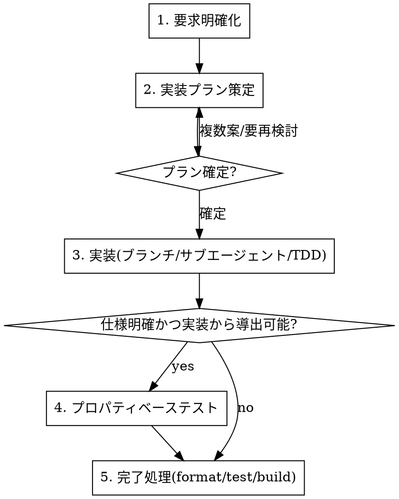

# アプリ開発フロー

このプロジェクトでのアプリ開発は、必ず以下のフェーズ順で進める。各フェーズには専用スキルがあり、メインエージェントが全体を管理しながらフェーズを進行させる。

**原則: 前のフェーズが完了し、必要なユーザー確認が取れるまで次のフェーズに進まない。**

## フロー全体

## 各フェーズと使用スキル

| フェーズ | 内容 | 使用スキル |
|---------|------|-----------|
| 1. 要求明確化 | 要求の曖昧さ・不足を質問で潰し、合意した要求を確定する | `clarify-requirements` |
| 2. 実装プラン策定 | 確定要求を元にプランを設計。複数案があれば選択を確認。別セッションに引き継げるよう一時ドキュメント化 | `implementation-planning` |
| 3. 実装 | 作業ブランチを切り、実装はサブエージェントに委譲。メインはレビュー・全体管理。t-wada推奨TDDで進め、作業毎にコミット | `subagent-tdd-implementation`（内部で `tdd` / `storybook-dev` / `component-create` を利用） |
| 4. プロパティベーステスト | 仕様が明確かつ対応コードから実装可能ならfast-checkで作成 | `property-based-testing` |
| 5. 完了処理 | フォーマッタ適用・全テスト実行・ビルド確認 | `check-creation` |

## 横断ルール（全フェーズ共通）

**同様のミスの指摘が複数回発生したら、必ず `CLAUDE.md` に再発防止ルールを追記する。** → `record-recurring-mistakes`

## メインエージェントの責務

- 各フェーズの完了判定とフェーズ間のゲート管理
- フェーズ2でのプラン確定（複数案はユーザーに選択を確認）
- フェーズ3では**実装そのものをサブエージェントに委譲**し、自身はレビューと進行管理に徹する
- 横断ルールの監視（同じ指摘の再発をCLAUDE.mdに反映）

## 禁止事項

- 要求が曖昧なまま実装プランに進むこと
- プラン未確定のまま実装に着手すること
- 作業ブランチを切らずに（mainで）実装を進めること
- メインエージェントが自分で実装を書き進めてしまうこと（委譲が原則）
- TDDのRed-Green-Refactorを飛ばすこと
- 完了処理（format/test/build）を省略して「完了」と報告すること
