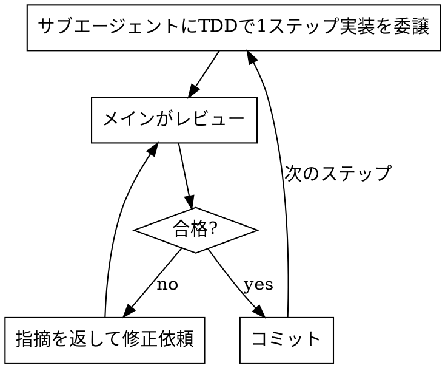

# サブエージェント委譲によるTDD実装（フェーズ3）

確定したプランを、作業ブランチ上で**サブエージェントに委譲**しながらTDDで実装する。メインエージェントは実装を自分で書かず、レビューと全体管理に徹する。

## 開始前

1. **作業ブランチを作成する**（mainで直接実装しない）。
   ```bash
   git switch -c feature/<対象名>
   ```
2. プランの作業分割（`tmp/plans/` のドキュメント）をタスク一覧として把握する。

## 実装サイクル（作業ステップごとに繰り返す）



### 1. 委譲

`Agent` ツールで実装ステップをサブエージェント（`general-purpose`）に委譲する。委譲プロンプトには必ず以下を含める:

- 対象ステップの要求と完了基準
- **t-wada推奨TDD（Red-Green-Refactor）で進めること** → `tdd` スキル準拠
- 作成するテストの種類（下記「テストの作成」）
- プロジェクト規約（コロケーション配置、import順、`@/` エイリアス）

### 2. レビュー（メインの責務）

サブエージェントの成果を必ずレビューする:

- テストが**先に**書かれ、Red→Greenを経ているか
- テストが振る舞いを正しく表現しているか（実装に追従しただけでないか）
- 要求・完了基準を満たすか、規約違反がないか
- 不足・誤りがあれば具体的な指摘を返して再依頼する

### 3. コミット（作業毎）

レビュー合格したら、その作業ステップ単位でコミットする。

```bash
git add -A && git commit -m "<このステップの内容>"
```

## テストの作成（プロジェクト標準）

実装対象に応じて以下を作る。配置は対象ソースと同じディレクトリ（コロケーション）。

| テスト種別 | ツール | 配置 | 目的 |
|-----------|--------|------|------|
| 単体テスト | vitest | `src/**/<name>.spec.ts(x)` | 関数・hook・ロジックの単体検証 |
| コンポーネントカタログ | Storybook Story | `src/components/<Name>/<Name>.stories.tsx` | 見た目のバリエーション（Light/Dark等） |
| 画面単体テスト | Storybook play function | 同上のStory内 `play` | コンポーネント単体のインタラクション検証 |
| 機能結合テスト | Storybook play function | `src/App.<対象>.stories.tsx` | 子コンポーネント込みの画面・機能の結合検証 |

- Story/play function の書き方・テーマバリエーションは `storybook-dev` スキルに従う。
- 新規コンポーネントの雛形は `component-create` スキルを使う。
- 結合テストの共通処理は `src/App.testUtils.ts` のような共通utilへ切り出す。

## 完了条件

- プランの全作業ステップが実装・レビュー済みで、各ステップがコミットされている
- 必要なテスト（単体／カタログ／play function単体・結合）が揃っている

完了したらフェーズ4（`property-based-testing`）の要否を判断する。

## 禁止事項

- mainブランチで直接実装すること
- メインエージェントが委譲せず自分で実装を書き進めること
- テストより先に実装を書くこと（TDD違反）
- レビューを省略してコミットすること
- 複数ステップをまとめて1コミットにすること（作業毎にコミットする）
